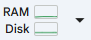

# AI & Machine Learning: From Theory to Practice

Slides and Hands-on exercises for learning applied machine learning workflows.

## Slides

### Day 1
| Title | Link |
|---|---|
| Breakout Session 1: AI as a Tool | [Data/Slides/breakout_01_ai_as_a_tool.pdf](https://raw.githubusercontent.com/uoy-research/tfds-course-ai/main/Data/Slides/breakout_01_ai_as_a_tool.pdf) |
| Episode 2: The Modern Powerhouses of AI, Part 1 | [Data/Slides/episode_02_the_modern_powerhouses_of_ai_1.pdf](https://raw.githubusercontent.com/uoy-research/tfds-course-ai/main/Data/Slides/episode_02_the_modern_powerhouses_of_ai_1.pdf) |
| Breakout Session 2: The Hard Questions | [Data/Slides/breakout_02_the_hard_questions.pdf](https://raw.githubusercontent.com/uoy-research/tfds-course-ai/main/Data/Slides/breakout_02_the_hard_questions.pdf) |
| Episode 3: The Modern Powerhouses of AI, Part 2 | [Data/Slides/episode_03_the_modern_powerhouses_of_ai_2.pdf](https://raw.githubusercontent.com/uoy-research/tfds-course-ai/main/Data/Slides/episode_03_the_modern_powerhouses_of_ai_2.pdf) |

### Day 2
| Title | Link |
|---|---|
| Episode 5: ML Lifecycle Fundamentals | [Data/Slides/episode_05_ml_lifecycle_fundamentals.pdf](https://raw.githubusercontent.com/uoy-research/tfds-course-ai/main/Data/Slides/episode_05_ml_lifecycle_fundamentals.pdf) |
| Episode 5 (abridged): ML Lifecycle Fundamentals | [Data/Slides/episode_05_ml_lifecycle_fundamentals_abridged.pdf](https://raw.githubusercontent.com/uoy-research/tfds-course-ai/main/Data/Slides/episode_05_ml_lifecycle_fundamentals_abridged.pdf) |
| Episode 6: Metrics, Pipelines & Tuning | [Data/Slides/episode_06_metrics_pipelines_tuning.pdf](https://raw.githubusercontent.com/uoy-research/tfds-course-ai/main/Data/Slides/episode_06_metrics_pipelines_tuning.pdf) |
| Episode 6 (abridged): Metrics, Pipelines & Tuning | [Data/Slides/episode_06_metrics_pipelines_tuning_abridged.pdf](https://raw.githubusercontent.com/uoy-research/tfds-course-ai/main/Data/Slides/episode_06_metrics_pipelines_tuning_abridged.pdf) |
| Episode 7: Using Pre-Trained AI | [Data/Slides/Episode_7_Using_Pre_Trained_AI.pdf](https://raw.githubusercontent.com/uoy-research/tfds-course-ai/main/Data/Slides/Episode_7_Using_Pre_Trained_AI.pdf) |

## Coding Exercises

Below are the available coding exercises. Each table shows the exercise name and quick links to open in Colab or view the source file in the repository.

### Getting Started
- Click the "Open in Colab" badge to open a notebook in Google Colab.
- Click `Copy to Drive` in Colab to save a personal copy if you want to edit or persist changes.
- Run cells with the Run button  or `Ctrl+Enter`. We recommend running cell-by-cell.
- To focus the last-running cell open the resources panel  and click the down arrow on the resources info (RAM/Disk) panel.

--- 
### Coding Exercise 1

| Exercise | Links |
|---|---|
| Adult Census Income (simple) |  · [Data/CodingExercises/CE1/01_ce1_adult_census_income_introduction_simple.py](Data/CodingExercises/CE1/01_ce1_adult_census_income_introduction_simple.py) |
| Adult Census Income (advanced) |  · [Data/CodingExercises/CE1/02_ce1_adult_census_income_introduction_advanced.py](Data/CodingExercises/CE1/02_ce1_adult_census_income_introduction_advanced.py) |

--- 

### Coding Exercise 2

| Exercise | Links |
|---|---|
| Adult Census Income Pipeline (simple) |  · [Data/CodingExercises/CE2/01_ce2_adult_census_income_pipeline_simple.py](Data/CodingExercises/CE2/01_ce2_adult_census_income_pipeline_simple.py) |
| Adult Census Income Pipeline (advanced) |  · [Data/CodingExercises/CE2/02_ce2_adult_census_income_pipeline_advanced.py](Data/CodingExercises/CE2/02_ce2_adult_census_income_pipeline_advanced.py) |
| Adult Census Income Pipeline (expert) |  · [Data/CodingExercises/CE2/03_ce2_adult_census_income_pipeline_expert.py](Data/CodingExercises/CE2/03_ce2_adult_census_income_pipeline_expert.py) |

---

